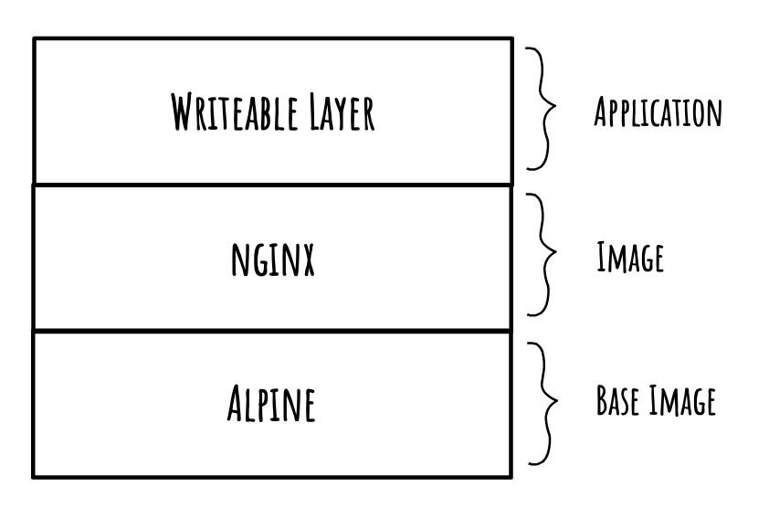

# Custom Image

how to build, deploy and work with an custom image

## Structure

Build a simple directory structure like the one below:

```
02-custom-image
|-- app
|   `-- index.html
|-- Dockerfile
`-- README.md
```

You don't have to sperate the application into a seperate directory, however it makes managing/updating the container image easier when the application grows.

## Dockerfile

A Dockerfile is how we create a new image that will be deployed as a container. It's essentially a text file with a list of simple instructions.

A container has layers, like an onion, or an ogre. Each instruction is considered a layer.

For example, this is a rough idea of what the nginx:alpine image looks like with your website code:



The contents of a simple Dockerfile built from the `nginx:alpine` image and with your site code copied over:

```
FROM nginx:alpine
COPY app/ /usr/share/nginx/html
```

## Build an Image

Once that dockerfile has been created, you can build the image. This can be done purely locally, however we will be building and pushing to a remote repo.

First we must ensure that we have a repo created in DockerHub, in your top bar, click the docker icon > Repositories > Create...

Add a name for this repository, for this example, I will be using `02-custom-image`. Images will be named after the account/repository that they belong to, so if my account name is `andrew` the image I am building will be named `andrew/02-custom-image`.


Now we build the image locally, the syntax for this is:
```
docker build [directory] -t [name]
```
So we will be running:
```
docker build . -t andrew/02-custom-image
```
You will see the build steps:
```
Sending build context to Docker daemon  52.74kB
Step 1/2 : FROM nginx:alpine
 ---> 55ceb2abad47
Step 2/2 : COPY app/ /usr/share/nginx/html
 ---> 8fada2cb3817
Successfully built 8fada2cb3817
Successfully tagged andrew/02-custom-image:latest
```
We can then push the image up to DockerHub:
```
docker push andrew/02-custom-image
```
We can see the image get pushed:
```
The push refers to repository [docker.io/andrew/02-custom-image]
f8bf62153d9b: Pushed
4fbb1bc8fd37: Mounted from andrew/02-custom-image
1bfeebd65323: Mounted from andrew/02-custom-image
latest: digest: sha256:3441dcf234de954bf321dd1586c5f6f571593e192434c8e712201a1e956e77db size: 946
```

If your image is hosted somewhere else, you should add the repository before your account name, it's not needed with DockerHub as it's the default:
```
git push docker.io/andrew/02-custom-image
```

## Deploy an Image

Deploying your custom image is now as easy as deploying an off-the-shelf image:
```
docker run -d -p 8000:80 andrew/02-custom-image
```
You will now see that the custom image is displayed at `http://localhost:8000`