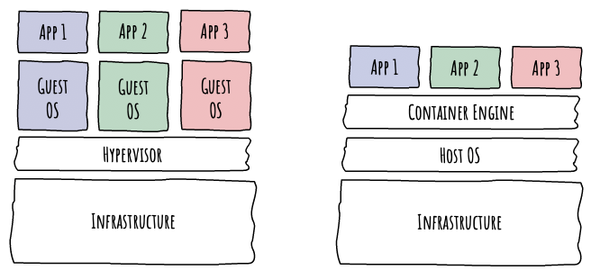
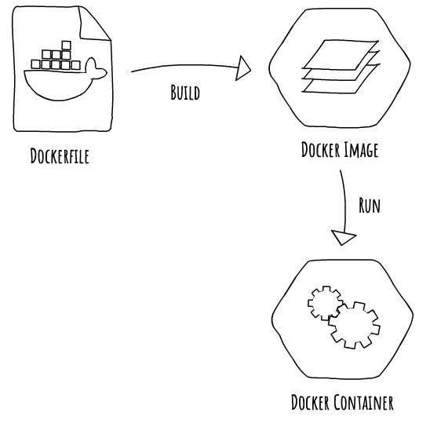
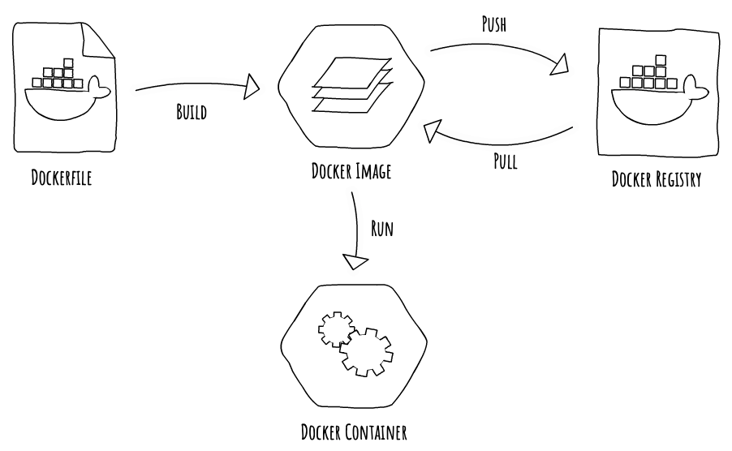
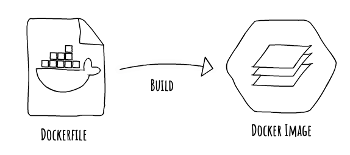
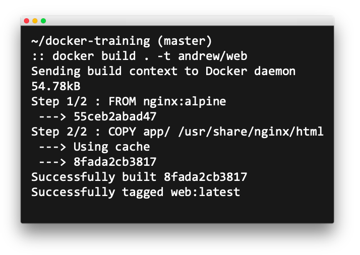
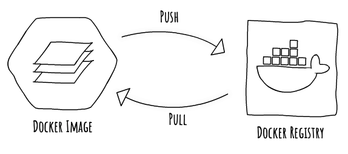
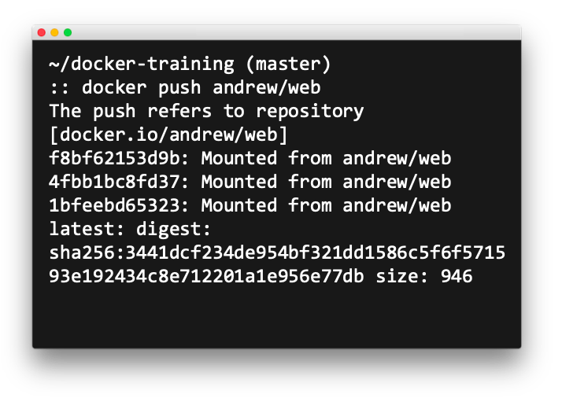
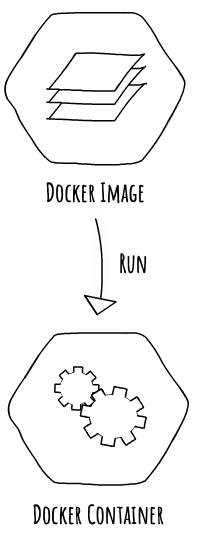
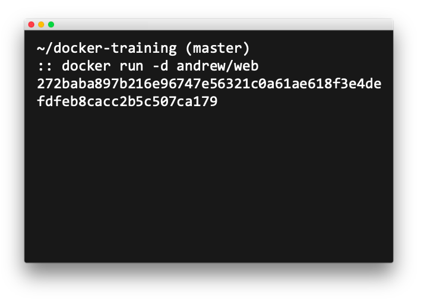
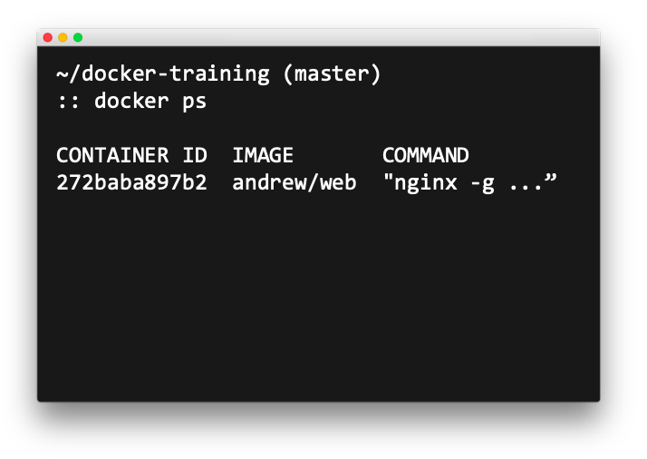

# Docker Training

This will hopefully give you a basic idea of what docker is and how to create and manage a containerized application using docker, using a couple of real world examples.


## What is Docker?

Docker is a containerization technology, one of many.

A container is a standard unit of software that packages up code and all its dependencies so the application runs quickly and reliably from one computing environment to another.

*https://www.docker.com/resources/what-container*


## Virtual Machines vs Containers

A virtual machine is a fully functional and distinct operating system, with everything packaged to run one or more applications. This allows virtual machines of different OS's to run natively on the hypervisor, allowing direct access to the infrastructure to the guest OS's.

A container is a process, bundled with the libraries and binaries required to run on a linux kernel.
The container engine allows these packaged processes to run on the Host OS as though they were native processes, but only allowing it to access the libraries and binaries included in the container. As it runs as a process on the Host OS, libraries and binaries that are common between containers will be shared without them needing to know about it.




## Docker Image

A Docker Image is the template of an un-deployed container

It contains the libraries, binaries, and code required to run the application

<!---
commenting out this image as it doesn't fit well in a readme
 
--->


## Image storage and deployment

A registry is a place to store and distribute images

There are many options:

- Self-hosted
- Docker Hub (default)
- Amazon Elastic Container Registry (ECR)
- Google Container Registry
- Azure Container Registry
- And more…




## Dockerfile

A Dockerfile is a text file that describes a container image.

Each line is a separate layer.

For example, to use a minimal nginx base image and copy app code from app/ to the web root:

```
FROM nginx:alpine

COPY app/ /usr/share/nginx/html
```


## docker build

<!---
commenting out this image as it doesn't fit well in a readme

--->

Docker command to create an image from a Dockerfile:

```
docker build [directory] [flag] [name]
```




## docker push

<!---
commenting out this image as it doesn't fit well in a readme

--->

Docker command to push an image to a remote registry:

```
docker push [name]
```




## docker run

<!---
commenting out this image as it doesn't fit well in a readme

--->

Docker command to run an image as a container:

```
docker run [flag] [name]
```




## docker ps

Docker command to show all running containers:

```
docker ps
```




## docker exec

Docker command to execute a command inside a running container. We usually use the `-it` flag for interactive TTY:

```
docker exec [flag] [containerID] [command]
```


## docker stop

Docker command to stop a running container:

```
docker stop [containerID]
```


## Excersizes

Firstly, visit [this guide](https://github.com/mrmcshane/docker-training/tree/master/00-setup) on how to quickly set up docker for mac.

Then there are several excersizes that will guide you through a lot of the basic functionality of docker and give you a decent grasp of how to build and manage containers:

1. [Off-the-shelf Image](https://github.com/mrmcshane/docker-training/tree/master/01-off-the-shelf-image)
2. [Custom Image](https://github.com/mrmcshane/docker-training/tree/master/02-custom-image)
3. [Database Container](https://github.com/mrmcshane/docker-training/tree/master/03-database-container)
4. [Multi-container Application](https://github.com/mrmcshane/docker-training/tree/master/04-multi-container-application)