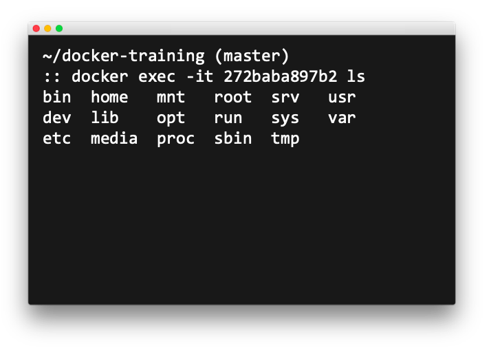

# Docker Training

This will hopefully give you a basic idea of what docker is and how to create and manage a containerized application using docker, using a couple of real world examples.


## What is Docker?

Docker is a containerization technology, one of many.

A container is a standard unit of software that packages up code and all its dependencies so the application runs quickly and reliably from one computing environment to another.

*https://www.docker.com/resources/what-container*


## Virtual Machines vs Containers


You’ve probably seen a diagram like this before, it gives an idea of the main differences between VMs and Containers.

On the left, we see a standard virtualization model: A hypervisor sitting on physical infrastructure, in the hypervisor there are a number of virtual machines, each with it’s own Guest OS.

This model gives you the ability to run application workloads on top of very different operating systems, which can be beneficial, but comes with a large overhead.


Containers build upon the idea of VMs, but move the abstraction one layer higher, removing the need to virtualize the Guest OS (mostly).

A container is essentially just a process running your application, bundled with any library dependencies. This allows a container to be smaller and more resource efficient than the old Virtual Machine model. 

Containers still contain an OS layer, but it’s usually something less than 10MB in size just to be able to interact with the Host OS.


## Docker Image


A Docker Image is a container template.

When a Dockerfile is built, it creates a docker image. The image contains the libraries, binaries, and code required to run the application.

Images are run on the container engine as containers.

As the idea is only one process per container, we aim to make this as streamlined as possible.


## Image storage and deployment

A registry is a place to store and distribute images

There are many options:

- Self-hosted
- Docker Hub (default)
- Amazon Elastic Container Registry (ECR)
- Google Container Registry
- Azure Container Registry
- And more…


## Dockerfile

A Dockerfile is a text file that describes a container image.


A container has layers, like an onion, or an ogre. Each instruction is considered a layer.

For example, to use a minimal nginx base image and copy app code from app/ to the web root:

```
FROM nginx:alpine

COPY app/ /usr/share/nginx/html
```

## Storage


By default, any data stored or created on a container is ephemeral (lost if the container is lost).

There are three different types of storage that can be assigned to a container:

- Bind Mount
  - Mounted directory from the docker host
  - Persistent across reboots
  - Used for something
- Volume
  - Virtual Disk created on docker host
  - Persistent across reboots
  - Bound to the specific host
- Tmpfs
  - In-memory ephemeral storage


## Networking

### Docker


- Host based network
- Discoverable containers by default
- Relies on Port Mapping

### Docker Compose


- Separate application networks
- Service based DNS resolution


## Docker Commands 

### docker help

For help with any of the docker functionality or to check any of the flags, you can use the help option:
```
docker --help
```


### docker build

Docker command to create an image from a Dockerfile:
```
docker build [directory] [flag] [name]
```


### docker push

Docker command to push an image to a remote registry:
```
docker push [name]
```


### docker run

Docker command to run an image as a container:
```
docker run [flag] [name]
```


### docker ps

Docker command to show all running containers:
```
docker ps
```


### docker exec

Docker command to execute a command inside a running container. We usually use the `-it` flag for interactive TTY:
```
docker exec [flag] [containerID] [command]
```




### docker stop / kill

Docker command to stop a running container:
```
docker stop [containerID]
docker kill [containerID]
```

docker kill stops the container instantly

docker stop sends a request to stop, and then a kill after a 10s grace period


### docker rm

Docker command to remove a stopped container:
```
docker rm [containerID]
```
This is useful to clean up containers once they are no longer needed


### docker image

List all local docker images:
```
docker images [Options]
```

Options:
```
[repository]        Specify only images from this repo
--filter [filter]   Filter Results
```


### docker volume

Work with docker volumes:
```
docker volume [Command] [Options]
```

Commands:
```
create      Create a volume
inspect     Display detailed information
ls          List volumes
prune       Remove all unused local volumes
rm          Remove one or more volumes
```


## Excersizes

Firstly, visit [this guide](https://github.com/mrmcshane/docker-training/tree/master/00-setup) on how to quickly set up docker for mac.

Then there are several excersizes that will guide you through a lot of the basic functionality of docker and give you a decent grasp of how to build and manage containers:

1. [Off-the-shelf Image](https://github.com/mrmcshane/docker-training/tree/master/01-off-the-shelf-image)
2. [Custom Image](https://github.com/mrmcshane/docker-training/tree/master/02-custom-image)
3. [Database Container](https://github.com/mrmcshane/docker-training/tree/master/03-database-container)
4. [Multi-container Application](https://github.com/mrmcshane/docker-training/tree/master/04-multi-container-application)
5. [Networking](https://github.com/valtech-uk/docker-training/tree/master/05-networking)
